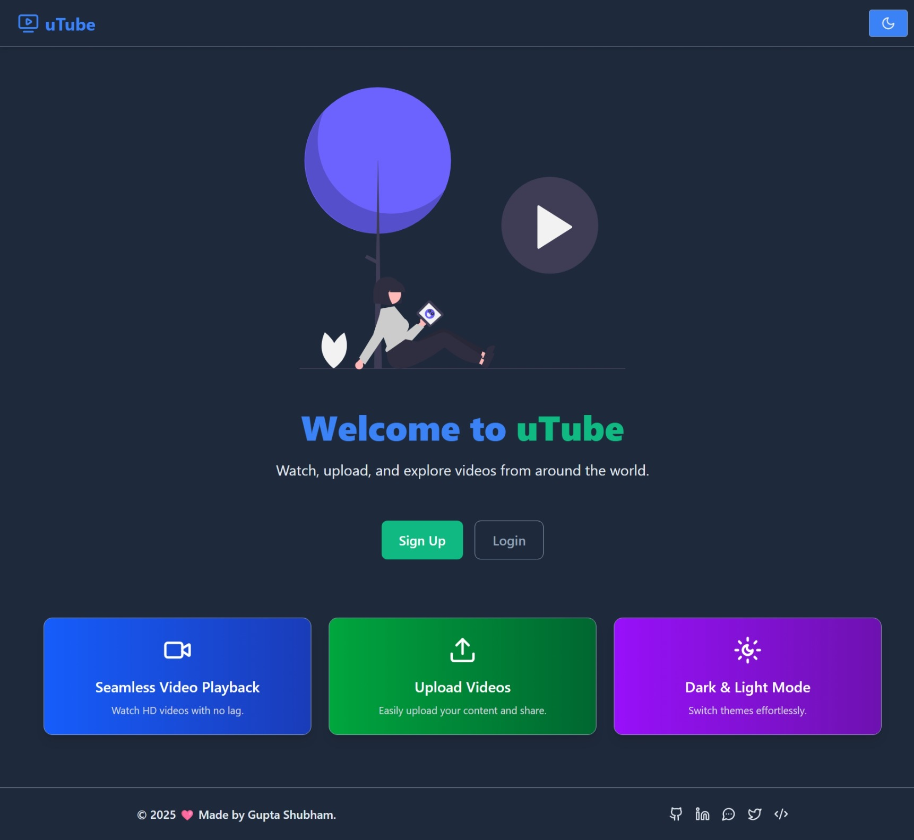
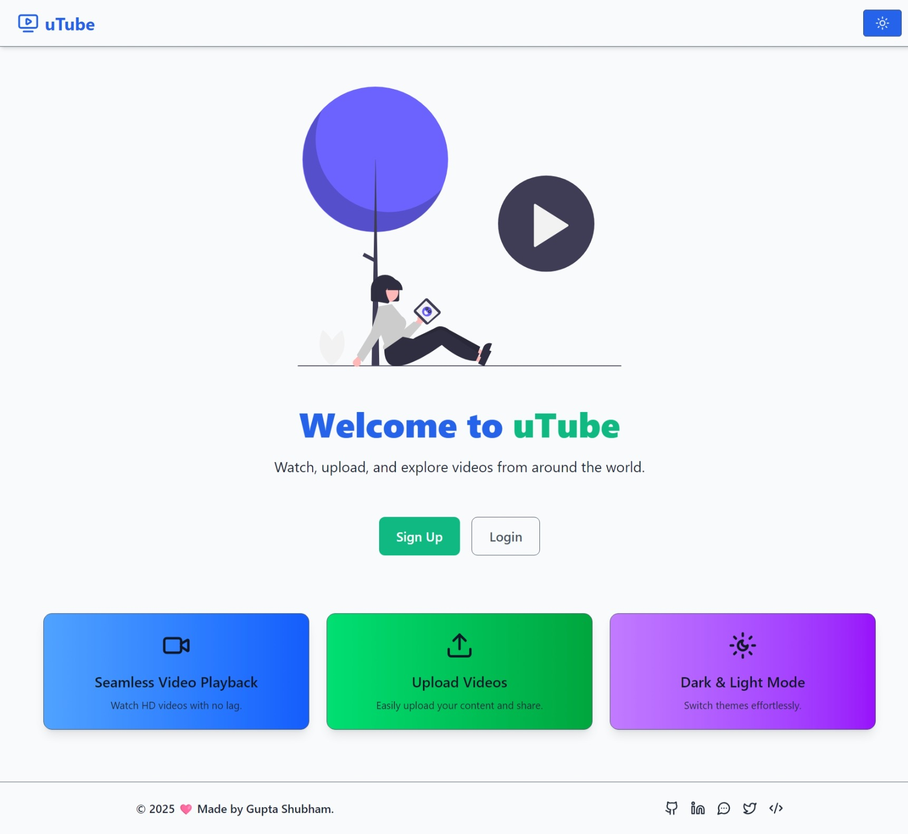
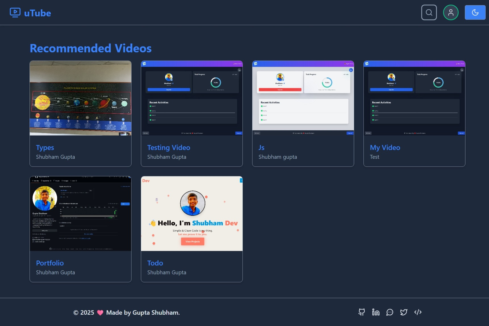

# 🎥 uTube Project

A full-stack **YouTube-like** video platform built using **MERN stack** with user authentication, video uploads, likes, comments, playlists, and subscriptions. 🚀

---

## 🌟 Features

### 🖥️ **Frontend (React + Vite)**

- ✅ **User Authentication** (Signup/Login)
- 🎬 **Upload and Manage Videos**
- ❤️ **Like, Comment, and Subscribe** to Channels
- 🔍 **Search and Browse Videos**
- 📂 **Create and Manage Playlists**
- 🌙 **Dark/Light Theme Toggle**

### ⚡ **Backend (Node.js + Express)**

- 🔐 **JWT Authentication & Secure APIs**
- 📹 **Video Processing and Storage (Cloudinary)**
- 📂 **Secure File Uploads (Multer)**
- 🛢 **MongoDB (Mongoose ORM) for Database Management**
- 🚦 **Error Handling & Response Standardization**
- 📊 **Dashboard for Video Analytics**
- 🔔 **Real-time Notifications (Future Update 🚧)**

---

## 🛠 Tech Stack

### 🏗️ **Frontend**

- ⚛️ React (Vite + Tailwind CSS)
- 🗃 Redux Toolkit (State Management)
- 🌍 React Router (Navigation)

### 🖥️ **Backend**

- 🛠 Node.js + Express.js
- 🛢 MongoDB (Mongoose ORM)
- ☁️ Cloudinary (Video Storage)
- 📂 Multer (File Uploads)
- 🔐 JWT Authentication

---

## 📂 Folder Structure

```plaintext
└── guptashubham-11-utube/
    ├── client/ (Frontend Code)
    │   ├── src/
    │   │   ├── api/ (API Calls)
    │   │   ├── components/ (Reusable UI Components)
    │   │   ├── features/ (Redux Slices)
    │   │   ├── pages/ (Main Screens)
    │   │   ├── store/ (Global Store)
    │   ├── public/ (Static Assets)
    │   ├── vite.config.js (Vite Configuration)
    │   ├── package.json (Frontend Dependencies)
    │   ├── .env.sample (Environment Variables Example)
    ├── server/ (Backend Code)
    │   ├── src/
    │   │   ├── controllers/ (Business Logic)
    │   │   ├── models/ (Database Schemas)
    │   │   ├── routes/ (API Endpoints)
    │   │   ├── middlewares/ (Middleware Functions)
    │   │   ├── utils/ (Utility Functions)
    │   ├── package.json (Backend Dependencies)
    │   ├── .env.sample (Environment Variables Example)
    ├── .husky/ (Pre-commit Hooks)
    ├── package.json (Root Dependencies)
```

---

## 🔧 Installation & Setup

### 1️⃣ Clone the Repository

```sh
git clone https://github.com/guptashubham-11/uTube.git
cd uTube
```

### 2️⃣ Install Dependencies

#### 📌 Frontend:

```sh
cd client
npm install
```

#### 📌 Backend:

```sh
cd server
npm install
```

### 3️⃣ Setup Environment Variables

Create a `.env` file in both `client` and `server` directories following `.env.sample` as a reference.

### 4️⃣ Run the Project

#### 🚀 Start Frontend:

```sh
cd client
npm run dev
```

#### 🚀 Start Backend:

```sh
cd server
npm start
```

---

## 📸 UI Preview

### 🎨 **Dark Mode**



### 🌞 **Light Mode**



### 📺 **Videos Screen**



### 📜 **Subscriptions Management**


## 🤝 Contributing

Suggestions are always welcome! 🌟 Feel free to contribute by **forking** the repository, making changes, and submitting a **pull request**. 🚀

---

---

💙 **made by [Gupta Shubham](https://github.com/guptashubham-11)** ✨
